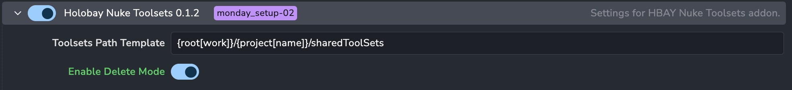
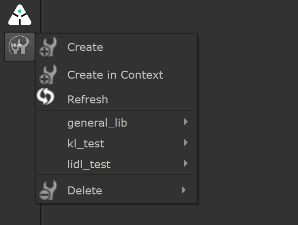

# Holobay Nuke Shared Toolsets

AYON addon providing shared toolsets functionality for Nuke. Allows artists to publish and share Nuke toolsets across projects.
The projects are actively retreived from Ayon.

## Features

- **Shared Toolsets**: Create and share Nuke toolsets across your team
- **Project-Based Organization**: Organize toolsets by project with configurable storage locations
- **Easy Publishing**: Simple UI panel to publish selected nodes as toolsets
- **Automatic Menu Integration**: Toolsets automatically appear in Nuke's menu
- **Delete Mode**: Optional toolset management and deletion capabilities

## Installation

1. Build the addon package:
   ```bash
   python create_package.py
   ```

2. Upload the package to your AYON server through the AYON web interface

3. Enable the addon in your AYON bundle

## Configuration




Configure the addon in AYON Studio Settings:

- **Toolsets Path Template**: Template to configure the location of the toolsets under each project
- **Enable Delete Mode**: Allow users to delete toolsets from the menu

## Usage




### Creating a Toolset

1. Select nodes in Nuke
2. Open **Nodes → sharedToolSets → Create**
3. Choose location and name
4. Click Create
5. **Create in Context** will use the folder structure from Ayon underneath root to store the toolset

### Loading a Toolset

1. Open **Nodes → sharedToolSets**
2. Navigate to your toolset
3. Click to load into your scene

### Refreshing the Menu

If toolsets don't appear, use **Nodes → sharedToolSets → Refresh**
